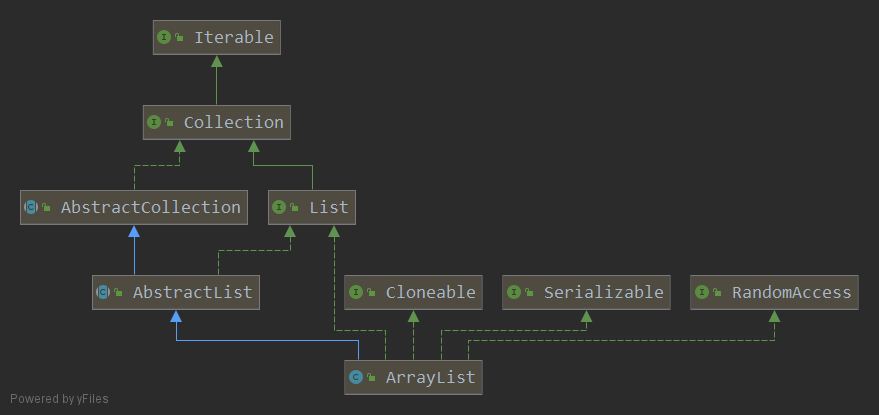

### ArrayList
####概述
ArrayList 是最常用的 List 实现类，内部是通过数组实现的，它允许对元素进行快速随机访问。   
数组的缺点是每个元素之间不能有间隔，当数组大小不满足时需要增加存储能力，就要将已经有  
数据的数组复制到新的存储空间中。当从 ArrayList 的中间位置插入或者删除元素时，需要对数组  
进行复制、移动，代价比较高。因此其适合随机查找和遍历，不适合插入和删除。  
####继承关系 

>ArrayList 继承自 AbstractList，实现了 List RandomAccess Serializable Cloneable 接口  
  
```
int DEFAULT_CAPACITY = 10;
Object[] EMPTY_ELEMENTDATA = {}; //含参构造函数但初始值为0
Object[] DEFAULTCAPACITY_EMPTY_ELEMENTDATA = {}; //无参构造函数构造默认容量的数组
transient Object[] elementData; //含参构造函数且初始值非0
```
>注: transient关键字修饰的变量不参与serialization持久化对象实例的过程。  
>如 elementData 的 capacity = 10 当前的 size = 5, 后面五个元素不需要持久化。详可见 readObject & writeObject 方法  
```
/*将当前elementData数组的length设置成当前数组元素的size大小,即删除动态增长的多余空间*/
trimToSize();

/*
保证数组至少可容纳minCapacity个元素,必要时进行动态扩容
*/
ensureCapacity(int minCapacity);

/*
扩容策略
Math.max(minCapacity - oldCapacity , oldCapacity / 2) + oldCapacity 
*/
grow(int minCapacity);

// 返回list中第一次出现目标元素的位置否则返回-1
int indexOf(Object o);
int indexOfRange(Object o, int start, int end);//顺序遍历

// 返回list中最后一次出现目标元素的位置否则返回-1
int lastIndexOf(Object o);
int lastIndexOfRange(Object o, int start, int end);//逆向遍历

//将list转换成object数组
Object[] toArray();

/*
when a.length <= size return T[] which size and content equals this.list
when a.legnth > size return T[] which size equals a.length and T[0,..size-1] equal this.list, T[size] = null, T[size + 1,..a.length - 1] equals a

e.g.
this.list = {"1","2","3"}
String[] a = {"4"} 
list.toArray(a) return {"1","2","3"}

String[] b = {"4","5","6"} 
list.toArray(b) return {"1","2","3"}

String[] c = {"4","5","6","7","8"} 
list.toArray(c) return {"1","2","3",null,"8"}

*/
<T> T[] toArray(T[] a);

/*
在指定位置插入element
若list.size equals elementData.length, 动态扩容
将elementData[index]到elementData[list.size - 1]所有元素往后挪1，插入element至index位置
*/
add(int index, E element);

//将elementData[i+1]到elementData[list.size - 1]所有元素往前挪1
fastRemove(Object[] es, int i);

//调用fastRemove方法删除元素并返回已删除的元素
remove(int index)；
```
#####Equals()
```
public boolean equals(Object o) {
    if (o == this) {
        return true;
    }

    if (!(o instanceof List)) {
        return false;
    }

    final int expectedModCount = modCount;
    // ArrayList can be subclassed and given arbitrary behavior, but we can
    // still deal with the common case where o is ArrayList precisely
    boolean equal = (o.getClass() == ArrayList.class)
        ? equalsArrayList((ArrayList<?>) o)
        : equalsRange((List<?>) o, 0, size);

    checkForComodification(expectedModCount);
    return equal;
}
```
>若两个对象地址一致则返回true  
>若Object o不是List子类直接返回false  
>若Object o是ArrayList类则调用equalsArrayList方法，反之调用equalsRange方法  
>最后调用checkForComodification方法判断fail-fast

```
boolean equalsRange(List<?> other, int from, int to) {
    final Object[] es = elementData;
    if (to > es.length) {
        throw new ConcurrentModificationException();
    }
    var oit = other.iterator();
    for (; from < to; from++) {
        if (!oit.hasNext() || !Objects.equals(es[from], oit.next())) {
            return false;
        }
    }
    return !oit.hasNext();
}

private boolean equalsArrayList(ArrayList<?> other) {
    final int otherModCount = other.modCount;
    final int s = size;
    boolean equal;
    if (equal = (s == other.size)) {
        final Object[] otherEs = other.elementData;
        final Object[] es = elementData;
        if (s > es.length || s > otherEs.length) {
            throw new ConcurrentModificationException();
        }
        for (int i = 0; i < s; i++) {
            if (!Objects.equals(es[i], otherEs[i])) {
                equal = false;
                break;
            }
        }
    }
    other.checkForComodification(otherModCount);
    return equal;
}
```
>equalsRange方法使用迭代器遍历判断所有值是否一致  
>equalsArrayList方法使用for循环遍历判断所有值是否一致，然后调用checkForComodification方法判断fail-fast   
>疑问  
> * 为啥两者使用遍历方式不同(List子类有linkedList,get方法获取元素时和迭代器相比有额外的开销，故用公共的迭代器遍历)  
> * 为何后者判断了fail-fast而前者不用(checkForComodification是ArrayList的私有方法)  
> * for和迭代器性能比较(for > iterator > forEach)

#####HashCode()
```
hashCodeRange(int from, int to) // forEach e-> hashCode = 31 * hashCode + (e == null ? 0 : e.hashCode());
```
>31作为乘子的原因：  
>a.更少的乘积结果冲突  
>b.31可以通过位运算被JVM优化  
```
addAll(Collection<? extends E> c) // 1.判断是否需要扩容  2.System.arraycopy 插入数组
addAll(int index, Collection<? extends E> c) // 1.判断是否需要扩容 2.将index后面的元素往后挪 s - index 个位置 3.System.arraycopy 插入数组
```

```
// 将toIndex后面的元素移动到fromIndex的位置 将数组最后 (toIndex - fromIndex) 个元素置为null
removeRange(int fromIndex, int toIndex);
shiftTailOverGap(Object[] es, int lo, int hi);

// 移除list中和指定集合c元素相同的所有元素
removeAll(Collection<?> c);
// 保留list中和指定集合c元素相同的所有元素
retainAll(Collection<?> c);

/* 
找到第一个需要保留的元素的位置
将剩下需要保留的元素移动到该位置
移除尾部所有其他位置的元素
*/
batchRemove(Collection<?> c, boolean complement, final int from, final int end);
```
#####SubList()
+ subList强制转换ArrayList会报ClassCastException // subList() 返回的是内部类 和ArrayList没有继承关系
+ non-structural changes both affects sourceList and subList
+ structural changes in subList will affect sourceList
+ structural changes in sourceList will generate ConcurrentModificationException in subList