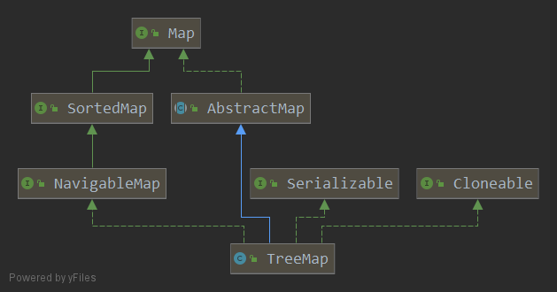

### TreeMap
####概述
TreeMap 

####继承关系 

```
// Constructor
TreeMap(); // non-comparator
TreeMap(Comparator<? super K> comparator); // given comparator
TreeMap(Map<? extends K, ? extends V> m); // non-comparator map
TreeMap(SortedMap<K, ? extends V> m); // sorted-map(have comparator)
```
```
// Copies all of the mappings from the specified map to this map
// 若map是sortedMap的之类且comparactor和this相同，调用this.buildFromSorted方法，反之调用super.putAll方法
putAll(Map<? extends K, ? extends V> map); 

buildFromSorted(int size, Iterator<?> it,
                                 java.io.ObjectInputStream str,
                                 V defaultVal);

Entry<K,V> buildFromSorted(int level, int lo, int hi,
                                             int redLevel,
                                             Iterator<?> it,
                                             java.io.ObjectInputStream str,
                                             V defaultVal);
```
```
// 获取第一个及最后一个键
K firstKey();
K lastKey();
final Entry<K,V> getFirstEntry(); // while -> get left node
final Entry<K,V> getLastEntry(); // while -> get right node
```