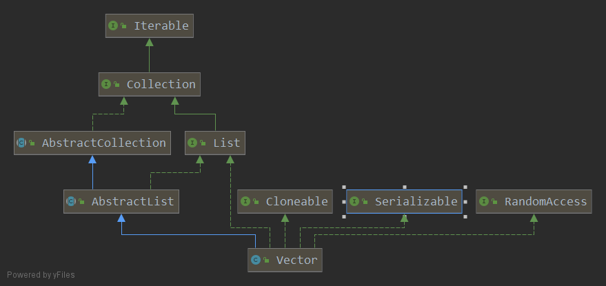

### Vector
####概述
Vector 与 ArrayList 一样，也是通过数组实现的，不同的是它支持线程的同步，即某一时刻只有  
一个线程能够写 Vector，避免多线程同时写而引起的不一致性，但实现同步需要很高的花费，  
因此访问速度比 ArrayList 慢。     
####继承关系 

>Vector 的继承关系和 ArrayList 一致，其继承自 AbstractList，实现了 List RandomAccess Serializable Cloneable 接口  


```
synchronized void copyInto(Object[] anArray); // vector中的元素复制到object数组中
synchronized void trimToSize(); //将当前elementData数组的length设置成当前数组元素的size大小,即删除动态增长的多余空间
synchronized void ensureCapacity(int minCapacity);//若capacityIncrement为0则增长一倍大小 反之扩容capacityIncrement
synchronized void setSize(int newSize);//若newSize大于当前size则扩容 反之newsize之后的元素置为空
Enumeration<E> elements();// return an enumeration of the components of this vector
synchronized void removeElementAt(int index);//删除指定位置元素，index后面的元素向前挪一个单位
synchronized void insertElementAt(int index);//index后面的元素向后挪一个单位，指定位置添加元素
synchronized List<E> subList(int fromIndex, int toIndex);//性质与ArrayList相同
```