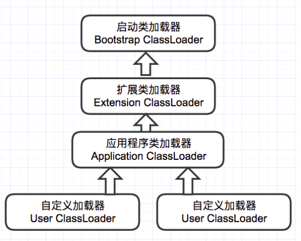

## 虚拟机类加载机制

### 类的生命周期

类从被加载到虚拟机内存开始，到卸载出内存为止，其整个生命周期包括：加载(Loading)、验证(Verification)、准备(Preparation)、解析(Resolution)、初始化(Initialization)、使用(Using)和卸载(Unloading)，其中验证、准备、解析3个部分统称为连接(Linking)。如下图所示


### 类加载的时机

虚拟机规范严格规定了*有且仅有* 以下五种情况必须立即对类进行 初始化(包括前面的加载、验证、准备阶段)

+ 遇到 new、getstatic、putstatic 或 invokestatic 这4条字节码指令时，如果类没有进行过初始化，则需要先触发其初始化。上述四条指令出现的代码场景分别是：*使用 new 关键字实例化对象*、*读取或设置一个类的静态字段(被 final 修饰、已在编译期把结果放入常量池的静态字段除外)*、*调用一个类的静态方法*

+ 使用 reflect 包的方法对类进行反射调用的时候，如果类没有进行过初始化，则需要先触发其初始化

+ 当初始化一个类的时候，如果其父类没有进行过初始化，则需要先触发其父类的初始化

+ 当虚拟机启动时，会先初始化主类(包含 main() 方法的那个类)

+ 当使用JDK 1.7的动态语言支持时，如果一个java.lang.invoke.MethodHandle实例最后的解析结果 REF_getStatic REF_putStatic REF_invokeStatic 的方法句柄，且这个方法句柄对应的类没有进行过初始化，则需要先触发其初始化

  上述五种场景中的行为称为是对一个类进行主动引用。除此以外所有引用类的方式称为 *被动引用*且不会触发初始化。以下为三个被动引用的例子：

  ```java
  /*被动引用 例子一*/
  /*通过子类引用父类的静态字段，不会导致子类初始化*/
  /*Hint:对于静态字段，只有直接定义这个字段的类才会被初始化*/
  public class SuperClass {
      static {
          System.out.println("Super Class Init !");
      }
  
      public static int value = 123;
  }
  
  public class SubClass extends SuperClass{
      static {
          System.out.println("SubClass Init !");
      }
  }
  
  public class ClassLoadTest {
      public static void main(String[] args) {
          System.out.println(SubClass.value);
      }
  }
  ```

  ```java
  /*被动引用 例子二*/
  /*通过通过数组定义来引用类，不会触发类的初始化*/
  public class ClassLoadTest {
      public static void main(String[] args) {
          SuperClass[] sca = new SuperClass[10];
      }
  }
  ```

  第二个例子并没有输出“SuperClass init !”，说明没有触发SuperClass类的初始化阶段。实际上这段代码触发了另一个类名为 [LSuperClass 的类的初始化过程，其是由虚拟机自动生成的、直接继承于 java.lang.Object 的子类，创建动作由字节码指令 newarray 触发。这个类代表了一个元素类型为SuperClass的一维数组，包含了数组应有的属性和方法。

  ```java
  /*被动引用 例子三*/
  /*常量在编译阶段会存入调用类的常量池中，本质上并没有直接引用到定义常量的类，因此不会触发定义常量的类的初始化*/
  public class ConstClass {
      static {
          System.out.println("ConstClass Init !");
      }
      public static final String HEELOWORLD = "hello world";
  }
  
  public class ClassLoadTest {
      public static void main(String[] args) {
          System.out.println(ConstClass.HEELOWORLD);
      }
  }
  ```

  第三个例子也没有输出“ConstClass Init !”。原因是编译阶段通过常量传播优化，已经将常量的值“hello world” 存储到了 ClassLoadTest 类的常量池中，以后ClassLoadTest 对常量Const.HELLOWORLD 的引用实际都转化为 ClassLoadTest  对自身常量池的引用

  > 接口也有初始化过程，接口与类初始化过程的区别在于 “当一个类初始化时，要求其父类全部都已经初始化”、“当一个接口初始化时，不要求其父接口全部完成初始化，只有在真正使用到父接口时在会初始化”
  
 ### 类加载的过程
 #### 加载
 加载阶段虚拟机主要完成以下三件事情:
 + 通过一个类的全限定名来获取定义此类的二进制字节流
 + 将这个字节流所代表的静态存储结构转化为方法区的运行时数据结构
 + 在内存中生成一个代表这个类的 java.lang.Class 对象，作为方法区这个类的各种数据的访问入口  

 获取二进制字节流有许多不同的方式：
 + ZIP包 ==> 常见的JAR、EAR、WAR等
 + 网络  ==> 典型的Applet应用
 + 运行时计算生成 ==> 动态代理技术，在 java.lang.reflect.Proxy中，就是用了 ProxyGenerator.generateProxyClass 来为特定接口生成形式为 "*$Proxy" 的代理类的二进制字节流
 + 其他文件 ==> 由JSP文件生成对应的class类
 
 > 数组类本身是由 Java 虚拟机直接创建，其元素类型(ElementType)是靠类加载器去创建
 > 一个数组类(简称C)创建过程遵循以下原则:
 > + 如果数组的组件类型(Component Type，指的是数组去掉一个维度的类型)是引用类型，那就递归加载这个组件类型，数组C将在加载该组件类型的类加载器的类名称空间上被标识
 > + 如果数组的组件类型不是引用类型(例如 int[] 类型)，java 虚拟机将会把数组C标记为与引导类加载器关联
 > + 数组类的可见性与它的组件类型的可见性一致，如果组件类型不是引用类型，那数据类的可见性将默认为public

 #### 验证
 验证阶段的主要目的是确保 class 文件的字节流中包含的信息是否符合当前虚拟机的要求，并且不会危害虚拟机自身的安全
 验证夹断大致上会完成下面4个阶段的检验动作:
 + 文件格式验证：基于二进制字节流验证是否符合 Class 文件格式的规范，并且能被当前版本的虚拟机处理
 + 元数据验证：对字节码描述的信息进行语义分析，以保证其描述的信息符合 Java 语言规范的要求(元数据信息的数据类型校验)
 + 字节码验证：通过数据流和控制流分析，确定程序语义是合法的符合逻辑的(类的方法体校验)
 + 符号引用验证：发生在符号引用转化为直接引用的时候(解析阶段)，确保解析动作能正常执行

 #### 准备
  准备阶段是正式为 **类变量** 分配内存并设置变量初始值的阶段，这些变量所使用的内存都将在方法区中进行分配。
  + 该阶段进行内存分配的仅包括类变量(被 static 修饰的变量)，而不是实例变量
  + 初始值 **通常情况** 下是指数据类型的零值
  
  ```
      /*准备阶段时初始值为0*/
      public static int value = 123;

      /*准备阶段初始化为123*/
      public static final int value = 123;
  ```
  > 方法一 该阶段未开始执行任何java方法，把value赋值为123的putstatic指令是程序被编译后，存放于类构造器<clinit>()方法中，所以赋值动作在初始化阶段执行  
  > 方法二 若类字段的字段属性表中存在ConstantValue属性，那么在准备阶段就会被初始化为ConstantValue指定的值
  
 #### 解析
 解析阶段是虚拟机将常量池内的符号引用替换为直接引用的过程。符号引用在Class文件中以CONSTANT_Class_info、CONSTANT_Fieldref_info、CONSTANT_Methodref_info等类型的常量出现。
 > 符号引用(Symbolic References):符号引用以一组符号来描述所引用的目标，符号可以是任何形式的字面量。符号引用与虚拟机实现的内存布局无关，引用的目标并不一定已经加载到内存中。  
 > 直接引用(Direct References):直接引用可以是直接指向目标的指针、相对偏移量或是一个能间接定位到目标的句柄。直接引用是和虚拟机实现的内存布局相关的，如果有了直接引用，那引用的目标必已存在于内存。
 
 虚拟机规范要求了在执行以下16个用于操作符号引用的字节码指令之前，会先对它们所使用的符号引用进行解析(anewarray、checkcast、getfield、getstatic、instanceof、invokedynamic、invokeinterface、invokespecial、invokestatic、invokevirtual、ldc、ldc_w、multianewarray、new、putfield和putstatic)
 若对同一个符号引用进行多次解析请求，除 invokedynamic 指令外(程序实际运行到该指令时才触发解析)，虚拟机实现可以对第一次解析的结果进行缓存(在运行时常量池中记录直接引用，并把常量标识为已解析状态)
 
 解析动作主要针对类或接口、字段、类方法、接口方法、方法类型、方法句柄和调用点限定符7类符号引用进行 
 1. 类或接口的解析  
 假设当前代码所处的类为D，如果要把一个从未解析过的符号引用N解析为一个类或接口C的直接引用，则虚拟机完成整个解析过程需以下三个步骤：
 + 如果C不是一个数组类型，那虚拟机会把代表N的全限定名传递给D的类加载器去加载类C
 + 如果C是一个数组类型，且数组的元素类型为对象(N的描述符会是[Ljava/lang/Integer形式)，那么虚拟机会按照上述规则加载数组元素类型，接着生成一个代表此数组维度和元素的数组对象。
 + 若上述未发生异常，进行符号引用验证，确认D是否具备对C的访问权限。/
 2. 字段解析  
 虚拟机首先会对字段表内class_index项中索引的CONSTANT_Class_info符号引用进行解析，也就是字段所属的类或接口的符号引用(用C表示)。如果解析成功完成，虚拟机规范会按照如下步骤对C进行 后续探索：
 + 如果C本身就包含了简单名称和字段描述符都与目标相匹配的字段，则返回这个字段的直接引用，查找结束。
 + 否则，如果在C中实现了接口，将会按照继承关系从下往上递归搜索各个接口和它的父接口，直到匹配。
 + 否则，如果C不是java.lang.Object类，将会按照继承关系从下往上递归搜索其父类直至匹配
 + 否则，查找失败，抛出java.lang.NoSuchFieldError异常
 查找过程成功返回引用后还会进行权限验证。(实际应用中，如果有一个同名字段同时出现在C的接口或父类中，编译器可能拒接编译)
 3. 类方法解析  
 类方法解析的第一个步骤与字段解析一样，也需先解析类方法表的class_index项中索引的方法所属类或接口的符号引用(仍用C表示)，如果解析成功则：
 + 类方法和接口方法符号引用的常量类型定义是分开的，如果在类方法表中发现class_index中索引的C是个接口，则抛出异常
 + 在类中查找是否有简单名称和描述符都与目标相匹配的方法
 + 否则，在类C的父类中递归查找是否有简单名称和描述符相匹配的方法
 + 否则，在类C实现的接口列表及它们的父接口中递归查找是否有简单名称和描述符相匹配的方法，若存在匹配的方法，说明类C是个抽象类，抛出AbstractMethodError异常
 + 否则，查找失败，抛出IllegalAccessError 异常
 4. 接口方法解析  
 虚拟机首先解析出接口方法表的class_index项中索引的方法所属的类或接口的符号引用，若解析成功则：
 + 如果在接口方法表中发现class_index中的索引C是个类而不是接口，则抛出异常
 + 否则，在接口C中查找是否有简单名称和描述符相匹配的方法
 + 否则，在接口C的父接口中递归查找，直到Object类为止
 + 否则，查找失败，抛出异常  
 接口中所有方法默认都是public所以不存在访问权限问题
 
 #### 初始化
 初始化阶段开始执行类中定义的 java 程序代码。主要做了初始化类变量和其他资源的工作，也可作另一个角度的表达：初始化阶段是执行类构造器 clinit() 方法的过程。
 + clinit() 方法是由编译器自动收集类中的所有类变量的赋值动作和静态语句块中的语句合并产生的，编译器收集的顺序与源文件中出现的顺序有关，静态语句块只能访问到定义在静态语句块之前的变量，定义在它之后的变量，静态语句块可以赋值，但是不能访问。
 + clinit() 方法与类的构造函数不同，它不需要显式地调用父类构造器，虚拟机会保证在子类的clinit()方法执行之前，父类的clinit()方法已经执行完毕。
 + 由于父类的clinit()方法先执行，父类中定义的静态语句块要优先于子类的变量赋值操作
 + clinit()方法对于类或接口来说不是必需的，如果一个类中没有静态语句块，也没有对变量的赋值操作，编译器可以不对其生存clinit()方法
 + 接口中不能使用静态语句块，但有变量初始化的操作，故接口也有clinit()方法。两者不同点在于，执行接口的clinit()方法不需要先执行父接口的clinit()方法，接口的实现类在初始化时也不会执行接口的clinit()方法。
 + 虚拟机会保证一个类的clinit()方法在多线程环境中被正确的加锁、同步，并发情况下，只会有一个线程执行这个类的clinit()方法，其他线程都需要阻塞等待。
 
 ### 类加载器
 类加载器只用于实现类的加载动作。对于任意一个类，都需要由加载它的类加载器和这个类本身一同确立其在java虚拟机中的唯一性。简而言之，对于同一个Class文件不同类加载器加载出来的类是不同的。
 #### 双亲委派模型
 + 启动类加载器(Bootstrap ClassLoader)
 负责加载 JAVA_HOME\lib 目录或者通过 -Xbootclasspath参数指定路径中的，且被虚拟机认可(按文件名识别)的类
 + 扩展类加载器(Extension ClassLoader)
 负责加载 JAVA_HOME\lib\ext目录或者通过 java.ext.dirs系统变量所指定的路径中的所有类库
 + 应用程序类加载器(Application ClassLoader)
 负责加载用户类路径(ClassPath)上所指定的类库
 
 >双亲委派模型工作过程：  
 >如果一个类加载器收到了类加载请求，它首先不会自己去尝试加载这个类，而是把这个请求委托给父类加载器去完成，因此所有的加载请求最终都应该传送到顶层的启动类加载器中，只有当父类加载器反馈自己无法完成这个加载请求时，子加载器才会尝试自己去加载  
 >优点：  
 >如果需加载 rt.jar包中的类 java.lang.Object，不管是哪个加载器加载这个类，最终都是委托给顶层的启动类加载器去加载，这样保证了使用不同的类加载器最终得到的都是同样一个Object对象