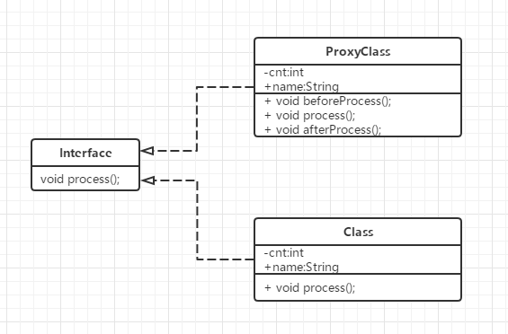

## 代理模式

### 定义

给某一个对象提供一个代理对象，并由代理对象控制对原对象的引用

### 类图



### 优点

+ 中介隔离-控制访问：如果委托类不允许直接被外部访问，或者委托类本身比较繁重时，代理类对象通过实现相同的接口，以更加轻量的形式介于客户类和委托类中间
+ 易于扩展：在代理中增加额外的功能来扩展委托类的功能，这样可以避免委托类进行修改。例如可以在代理类中加入日志打印、消息预处理、消息过滤、幂等性校验等公共的业务，使业务代码关注于业务实现本身。

> 静态代理：代理类和委托类实现同一个接口，静态代理中的代理类在编译期就已经确定，效率相对于动态代理相对高一些，但是代码耦合性高，一旦需修改接口，代理类和委托类都需要修改。
>
> 动态代理：代理对象在运行期间动态创建，代码耦合度低，使用较为灵活

### 静态代理

```java
// 接口类
public interface IPay {
    void pay();
}
// 委托类
public class Pay implements IPay {
    @Override
    public void pay() {
        System.out.println("I have payed for this goods ...");
    }
}
// 代理类
public class PayProxy implements IPay{

    private Pay pay;

    public PayProxy(Pay pay) {
        this.pay = pay;
    }

    @Override
    public void pay() {
        // Before pay
        System.out.println("Plz make sure u have enough money ...");

        pay.pay();

        // After pay
        System.out.println("Welcome next time ...");
    }
}
```

> + 若存在n个委托类，需要实现为每个委托类实现对应的代理类，代码冗余
> + 若实现接口需要进行修改，则代理类也需要进行修改

### 动态代理

```java
// jdk 动态代理 基于接口实现
// 动态代理拦截器
public class DynamicProxyHandler implements InvocationHandler {

    private Object object;

    public DynamicProxyHandler(Object object) {
        this.object = object;
    }

    @Override
    public Object invoke(Object proxy, Method method, Object[] args) throws Throwable {
        System.out.println("Before Dynamic proxy handle ...");
        Object res = method.invoke(object, args);
        System.out.println("After Dynamic proxy handle ...");
        return res;
    }
}

// main 方法
public static void main(String[] args) {
    // 委托类
    IPay pay = new Pay();
    // 动态代理生成代理类
    IPay payProxy = (IPay)Proxy.newProxyInstance(Pay.class.getClassLoader(), new Class[]{IPay.class}, new DynamicProxyHandler(pay));
    
    payProxy.pay();
}
```

> Proxy.newProxyInstance() 方法接受三个参数：
>
> + ClassLoader loader 指定当前目标对象使用的类加载器
> + Class<?>[] interfaces 指定目标对象实现的接口列表，泛型表示类型
> + InvocationHandler 指定动态处理器，执行目标对象的方法时，会触发事件处理器的方法

---

```java
// cglib 动态代理 基于父类实现
public class CglibProxy implements MethodInterceptor {
    private Object target;

    public Object createProxy(Object target) {
        this.target = target;
        Enhancer enhancer = new Enhancer();
        enhancer.setCallback(this);
        enhancer.setSuperclass(this.target.getClass());
        return enhancer.create();
    }

     public Object intercept(Object arg0, Method arg1, Object[] arg2,
                             MethodProxy arg3) throws Throwable {
         System.out.println("Before cglib Dynamic proxy handle ...");
         Object result = arg1.invoke(this.target, arg2);
         System.out.println("After cglib Dynamic proxy handle ...");

         return result;
     }
}
// main 方法
public static void main(String[] args) {
    // 委托类
    IPay pay = new Pay();
    // cglib生成代理类
    CglibProxy cglibProxy = new CglibProxy();
    IPay payProxy = (IPay)cglibProxy.createProxy(pay);
    
    payProxy.pay();
}
```

